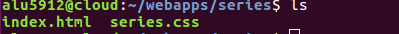
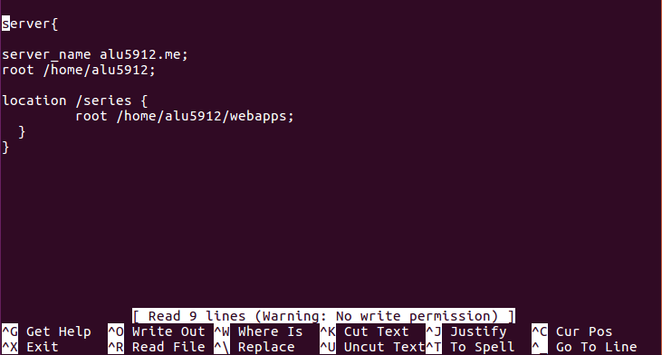
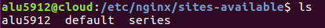
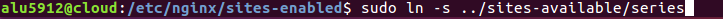
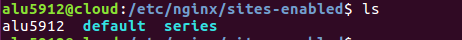
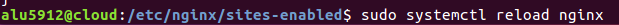

# PRACTICA con ningx

#### 1 /primero metemos nuestro index.html junto con su css en la carpeta "webapps/series"

#### 2 /luego vamos a la carpeta "etc/ningx/sistem-available" y creamos un archivo llamado "series" y metemos  el nombre del servidor para que conecte con la pagina en nuestro caso alu5912.me y tambien la localizacion del index.html para que se vea en pantalla

 #### de manera que cuando pongamos en nuestro navegador alu5912/series nos aparecera en pantalla lo que hemos creado
 

 #### 3 /hora tenemos que crear el enlace simbolico con este comando
 
#### que es como un acceso directo que hara que todo se muestre cuando pongamos la ruta en el navegador

#### 4 /por ultimo reiniciamos el nginx

### 5 /y por ultimo tenemos la pagina en nuestro serivor en la ruta que pusimos

