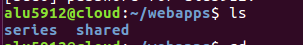
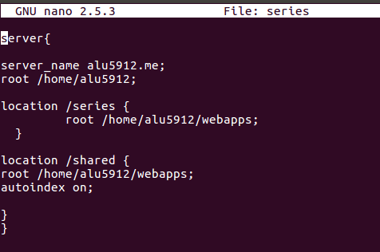
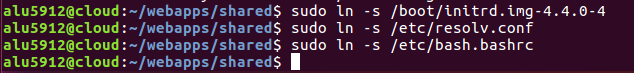
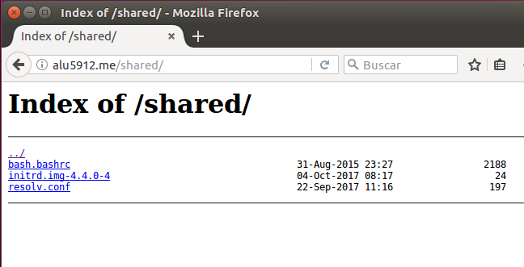

# Listado de directorios con NGINX

* ### Paso-1
    #### Creamos la carpeta "shared"

    

* ### Paso-2
    #### Vamos al fichero de series en sites-available y escribimos una parte nueva , ponemos la ruta donde esta la carpeta shared y ponemos "autoindex on"

* ### Paso-3
  #### enlazamos todo lo que queramos que nos aparezca en nuestra lista de la siguiente manera

 #### reinicamos el nginx y listo

  * #### Paso-4

   
