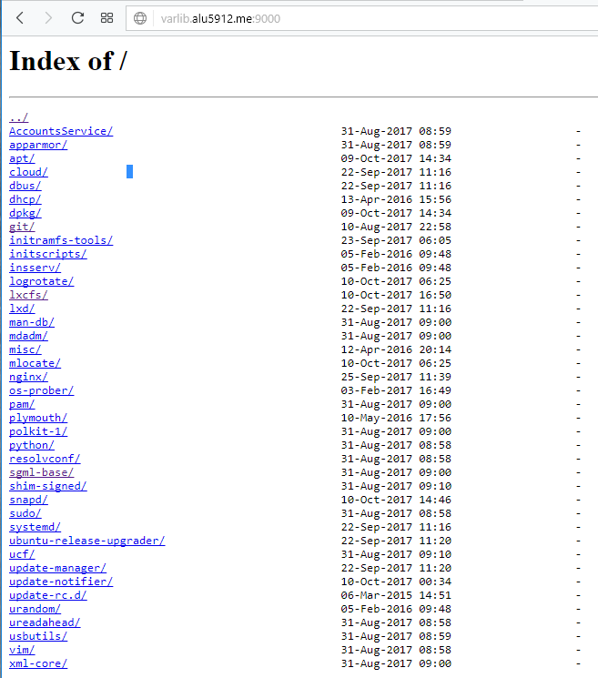

# Trabajo con virtual hosts

* ## Sitio web 1
  * Primera direccion  

         http://imw.alu5912.me

  

   * Tiene que enseñar una pagina con la imagen de "Diagrama de trabajo" que esta en moodle.  
    Para ello debemos descargar imagen y enlazarla en un html a una carpeta con esa imagen  

  * En server_name ponemos  como queremos que sea el enlace de la pagina y en root su ubuacion , luego en location ponemos la ubicacion de donde esta ubicado nuestro html para que se vea en pantalla    

  *contenido del html* :  

    

  *Lo que se muestra en la pagina* :

     
  *  

 * Segunda direccion    

         http://imw.alu5912.me/mec

  * Aqui se debe mostrar un enlace al real decreto del titulo de ASIR  
       *   para ello solo tenemos que abrir un location en el mismo fichero de configuracion de antes y ponemos la ruta donde hemos puesto el enlace     

  *Contenido del html*:   

       

  *Lo que se muestra en la pagina* :     

      

   *El real decreto cuando haces click el link *     

      

   * ## Sitio web 2  
         http://varlib.alu5912.me:9000

    *  En esta parte solo tenemos que crear un nuevo fichero en sites-available y poner que el serever_name se llame varlib.alu5912.me , que use el puerto 9000 , le ponemos la ruta de los directorios  que quieres que aparezcan y  ponemos autoindex on para que aparezca una lista con todo el contenido de esa carpeta   

     

   *Asi tiene que quedar la pagina* :  
      

  * ## Sitio web 4  
   * Primera direccion  

            http://redirect.alu5912.me  

   * Esta direccion se tiene que redirigir a:   

          http://target.alu5912.me
    * Tambien tenemos que ahcer que se reedirigan a:    

           http://redirect.aluXXXX.me/test/    

           http://www.redirect.aluXXXX.me/probando/   

           http://www.redirect.aluXXXX.me/hola/        

   * Para ello ponemos un listen al puerto 80 para paginas web , ponemos el server_name que nos dicen , la ruta y lo nuevo seria poner return 301 y la pagina que queremos que nops reedirigan  mas los location con "/test"  "/probando" "/hola" de tal forma:     

      

  *asi cuando pongamos el link nos redigira a esta pagina la cual hemos descomprimido y puesto en cierta ruta*  :

     

  * Segunda direccion     

           http://target.alu5912.me
* Tenemos que descargar la pagina descomprimir en la ruta para que nos salga en pantalla   

* En este caso solo es poner el server_name la ruta  y los logfiles dentro de los location   

*fichero del target*    

       

*lo que descargamos*    

       

*pagina que descargamos*:  

  
