# *Sirviendo aplicaciones Php y Python*  

## Sitio web 1:    

     Tenemos que hacer una pagina con la URL ("http://php.alu5912.me") y que contenga una pagina en php

> Para ello tenemos que descargar la pagina  que se encuentra en el moodle como "demo_php.zip"

* Primero pasamos la pagina del moodle a la maquina de produccion y la descomprimimos :  

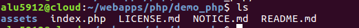

* Luego creamos el virtual host al que llamaremos php   

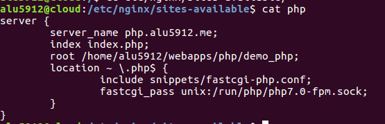
* Y Tambien su respectivo enlace simbolico  

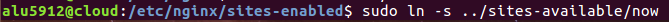  

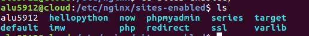
* Por ultimo reiniciamos NGINX  y cuando  accedemos a ("http://php.alu5912.me") ya nos saldria la pagina

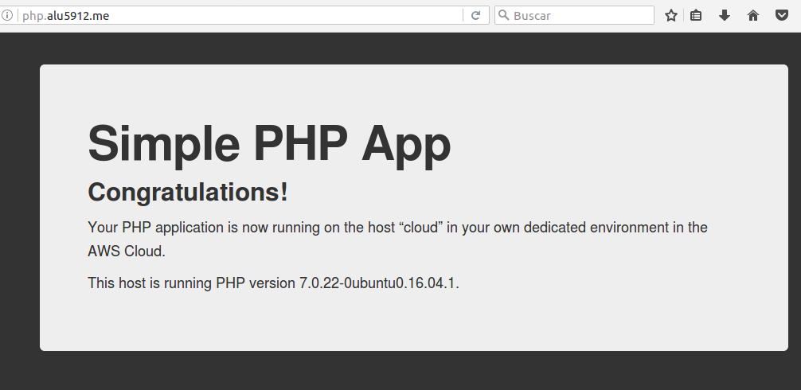

## Sitio web 2:    

    Tenemos que hacer una pagina con Python y que la podamos contralar con el supervisor , la pagina se hara con esta URL ("http://now.alu5912.me")

> ponemos el codigo de python que esta ya en el moodle  

* Primero creamos un entorno virtual con virtualenvs (sirve para instalar app en la misma maquina sin que estan interfieran con otros virtalenvs que instalemos) y lo activamos

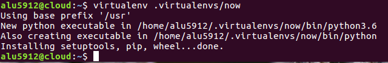

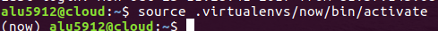   

* Luego miramos si tenemos instalado el flask (un frameroot escrito en python para crear aplicaciones mas rapido)    

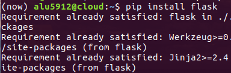

* Ahora  creamos una carpeta en   ~$HOME que se llame "now" ,dentro creamos un  archivo llamado "main.py" y metemos el codigo de python que nos dejaron en el moodle

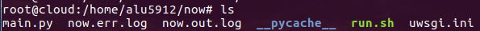  

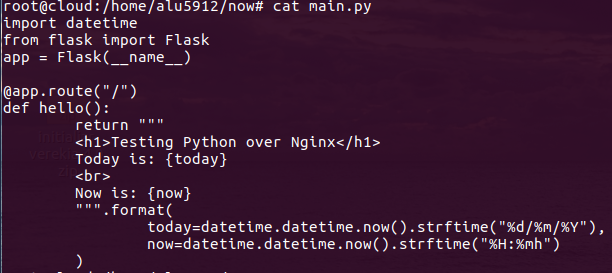

* En este punto usamos el proceso uwsgi para que escuche peticiones en cierto puerto  ("http://alu5912.me:8080")

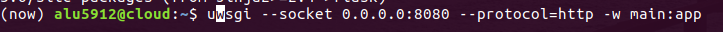  

### *Configuración del sitio web*

* Primero ceramos un fichero de configuracion de uwsgi en la carpeta now para controlar este proceso

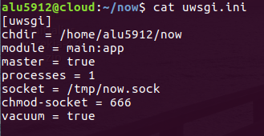  

* Luego creamos un scrip que activara el entorno virtual de la aplicacion  y lanzar en proceso uwsgi.ini   

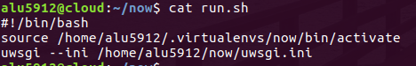    

* Le damos permisos al scrip

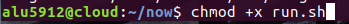   

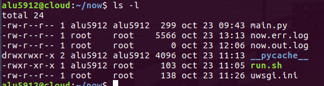    

* y lo ejecutamos:  

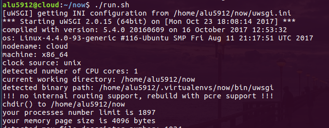   

### *Parte de nginx*  

* Primero creamos el virtual host:    

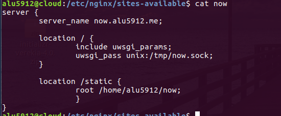   

* Y su respectivo enlace simbolico:    

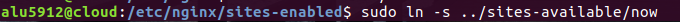    

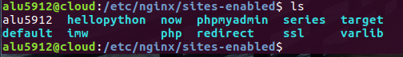    

* Reiniciamos nginx , ponemos (now.alu5912.me) y nos saldra lo siguiente porque el servicio no esta escuchando en el socket

  

* Para que funcione deberiamos lanzar el scrip ./run.sh  

  

* y ya nos saldria la pagina

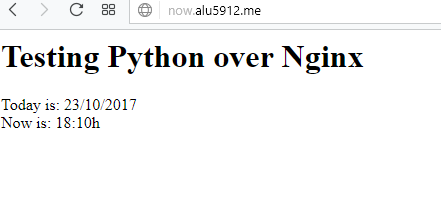   

### *Parte Supervisor*    

* En primero lugar, para que la aplicacion siempre funcione y poder contrlarla debemos instalar supervisor *sudo apt-get install supervisor*  

* Miramos a ver si funciona con "status":  

#### *Configuramos supervisor*  

* Para que funcione supervisor ,necesitamos crear un programa para ello en esta ruta:   

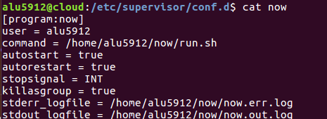

* Ahora creamos un grupo para incluir los desarrollares de supervisor :  

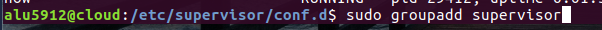   

* y modificamos el fichero de configuracion de supervisor de la siguiente manera:  

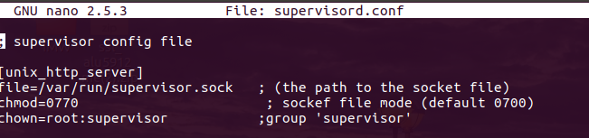   

* y reiniciamos supervisor  con "reload" para que recargue y coja todos los cambios  

* hacemos un status:  

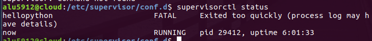   

* y ahora si accedemos a ("http://now.alu5912.me") nos mostrara la pagina :   

#### *Controlamos la aplicacion con supervisor*  

* la paramos :  

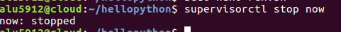   

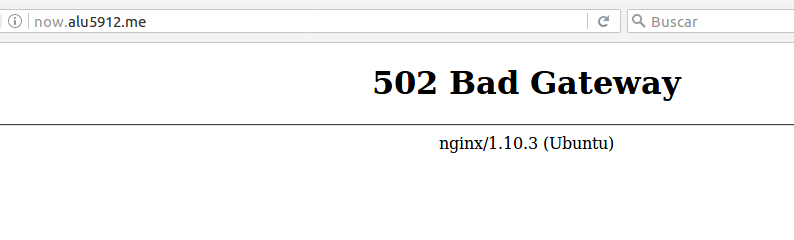   

* Y la encendemos :  

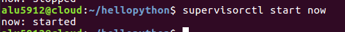    

   
