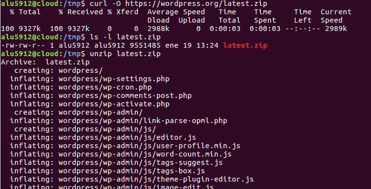

#  Implantación de Wordpress

## 1.-Paso 1 Instalamos Mysql

>Creamos la base de datos de Wordpress

## 2.-Descargamos el codigo fuente de Wordpress

**A continuación descomprimimos el código y lo copiamos en /usr/share:**

**Ponemos los permisos necesarios para el usuario www-data**

**Especificamos el nombre de la base de datos, el usuario y la contraseña, para que Wordpress pueda usarlos:**

## 3.-Editamos el fichero de configuración:

## 4.-Configuramos el acceso mediante nginx

## 5.-Configuramos el sitio web
>Accedemos con  http://wordpress.alu5912.me y nos reedigira a http://wordpress.alu1912.me/wp-admin/install.php

## 6.-Cambiamos el limite de tamaño en la subida de archivos

> y reiniciamos el Nginx con  `sudo systemctl restart php7.0-fpm.service`

**Además de esto, debemos añadir una línea en el fichero de configuración de Nginx:**

**Ahora en configuracion de Wordpress  vamos a `Ajustes/Enlaces permanentes` y marcamos Dia y nombre**

**Ahora debemos indicar a Nginx que procese estas URLs **

>Para poder acceder con `http://wordpress.alu1519.me/admin`

## 7.-Comprobamos con tree los ficheros de Wordpress

## 8.- Ahora metemos las estadisticas de wordpress en una nueva entrada de nuestra pagina

